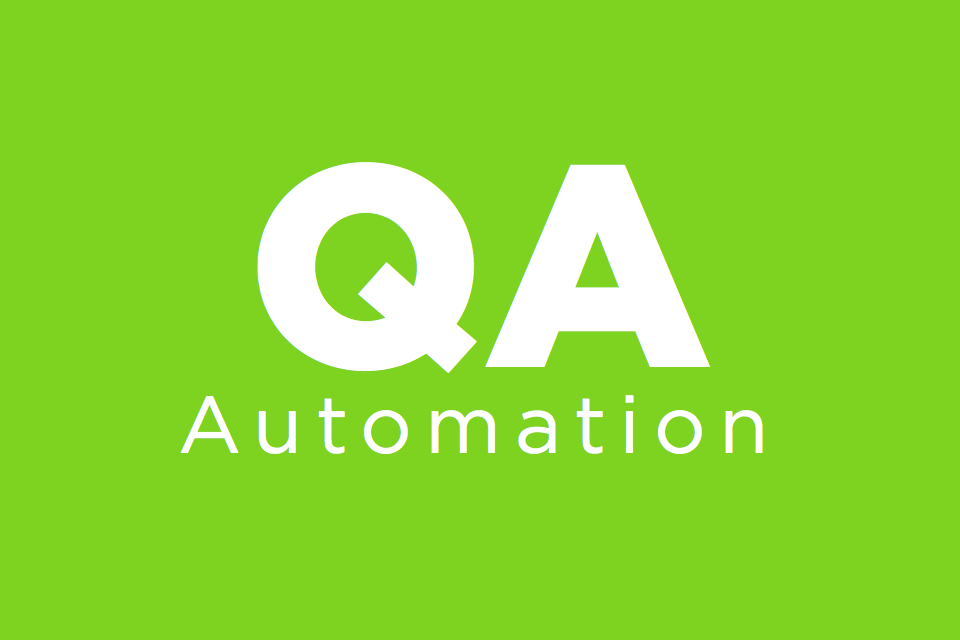

# [Автоматизация тестирования с помощью Selenium и Python](https://stepik.org/course/575)

Репозиторий с решением практических заданий курса.

## Запуск

Для работы с проектом и зависимостями используется менеджер пакетов `uv`.

1. Синхронизация окружения и установка зависимостей:
```bash
uv sync
```

2. Запуск нужного файла:
```bash
uv run python3 /path/to/executive/file.py
```
